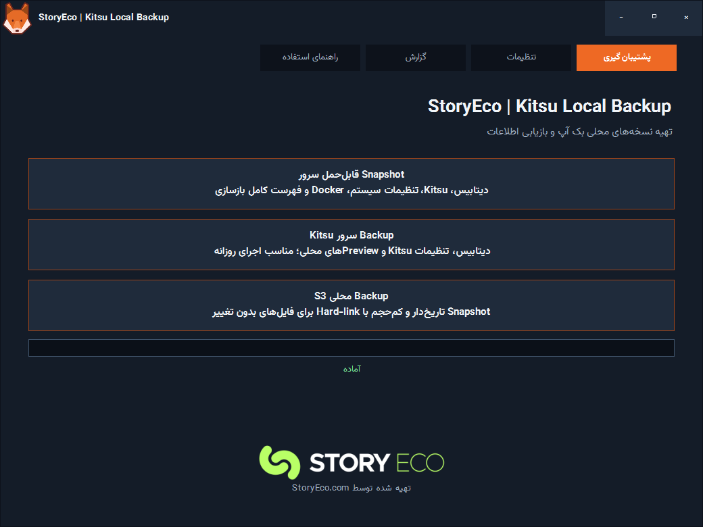
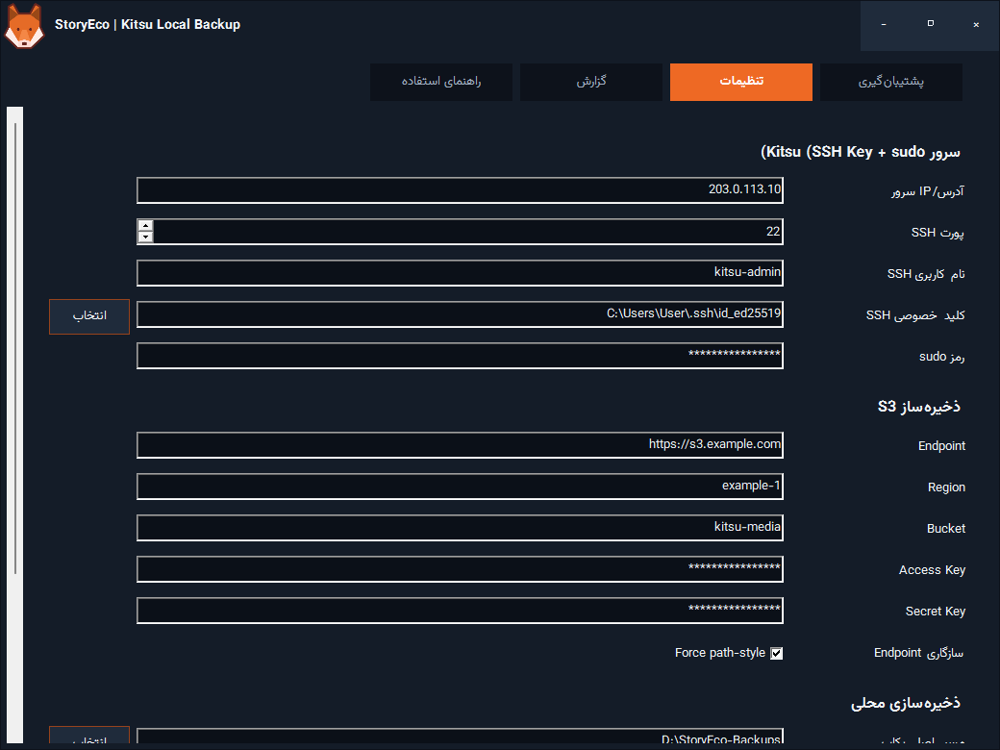
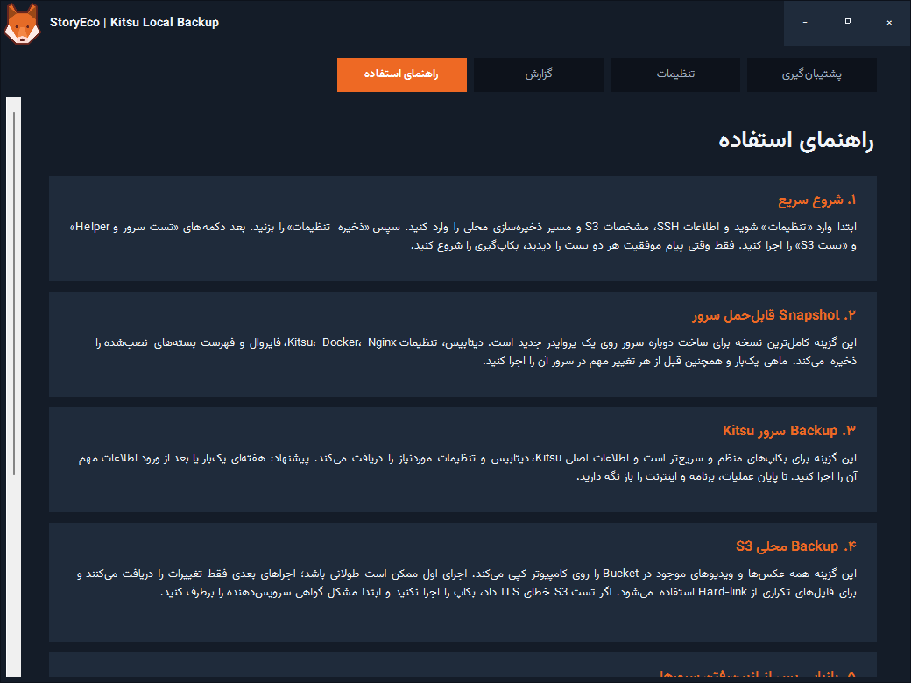

# StoryEco | Kitsu Local Backup

ابزار دسکتاپ ویندوز برای تهیه نسخه‌های محلی و قابل‌انتقال از سرور **Kitsu/Zou** و فضای ذخیره‌سازی **S3**.

این برنامه برای زمانی ساخته شده است که نمی‌خواهید تنها نسخه اطلاعات شما نزد یک ارائه‌دهنده ابری باقی بماند. خروجی‌ها مستقیماً روی کامپیوتر ویندوز ذخیره می‌شوند و برای مهاجرت به سرور یا ارائه‌دهنده جدید قابل استفاده‌اند.

> این پروژه ابزار مستقل StoryEco است و محصول رسمی یا مورد تأیید CGWire نیست. Kitsu و نشان‌های مرتبط متعلق به صاحبان اصلی آن‌ها هستند.

<p align="center">
  
</p>

<details>
<summary>تصاویر بیشتر از تنظیمات و راهنمای فارسی</summary>





</details>

## ویژگی‌ها

- رابط فارسی، RTL و کاملاً راست‌چین با فونت Vazirmatn
- طراحی Dark و Borderless با ناوبری اختصاصی
- اتصال SSH فقط با کلید خصوصی
- نصب و آزمایش Helper سرور از داخل برنامه
- تهیه دو نوع خروجی از سرور Kitsu
- دریافت محلی تمام فایل‌های Bucket سازگار با S3
- ساخت Snapshotهای تاریخ‌دار S3 با NTFS Hard-link برای کاهش مصرف فضا
- ساخت `manifest.json`، گزارش اجرا و SHA-256 برای کنترل سلامت خروجی سرور
- ذخیره امن رمز sudo و کلیدهای S3 با Windows DPAPI
- حذف خودکار فایل موقت تنظیمات rclone پس از هر اجرا
- اعتبارسنجی اجباری TLS؛ امکان خاموش‌کردن بررسی گواهی وجود ندارد
- پنل راهنمای داخلی برای شروع، بکاپ و بازیابی

## دریافت نسخه آماده

از بخش [Releases](../../releases/latest) آخرین فایل ZIP را دریافت و در یک پوشه ثابت Extract کنید. ساختار پوشه Release باید حفظ شود:

```text
StoryEco-Kitsu-Local-Backup/
├── KitsuLocalBackup.exe
├── README.md
├── THIRD-PARTY-NOTICES.md
├── LICENSE
├── server/
│   └── storyeco-backup-export
└── tools/
    └── rclone.exe
```

سپس `KitsuLocalBackup.exe` را اجرا کنید. برنامه Portable است و Installer جداگانه ندارد.

## پیش‌نیازها

### کامپیوتر ویندوز

- Windows 10 یا Windows 11 نسخه 64 بیتی
- دسترسی به `ssh.exe` و `scp.exe` ویندوز
- فایل کلید خصوصی SSH مانند `id_ed25519`
- فضای خالی کافی برای دیتابیس، تنظیمات و فایل‌های S3
- درایو NTFS برای استفاده از قابلیت Hard-link
- BitLocker یا یک درایو رمزنگاری‌شده برای نگهداری امن بکاپ‌ها

### سرور Kitsu

نسخه فعلی برای نصب Kitsu روی Ubuntu 24.04 و ساختار زیر طراحی شده است:

- Docker Engine و Docker Compose
- PostgreSQL و Redis در `/opt/kitsu/docker-compose.yml`
- فایل محیطی `/opt/kitsu/.env`
- محیط Zou در `/opt/zou`
- سرویس‌های `kitsu-infra.service`، `zou.service` و `zou-events.service`
- Nginx
- کاربر SSH دارای دسترسی `sudo`

اگر نصب شما مسیرها یا نام سرویس‌های متفاوتی دارد، فایل `server/storyeco-backup-export` را پیش از استفاده متناسب با سرور خود تغییر دهید.

## شروع سریع

### ۱. تنظیم اتصال SSH

در پنل «تنظیمات» مقادیر زیر را وارد کنید:

- **آدرس/IP سرور:** IP یا Hostname سرور Kitsu
- **پورت SSH:** معمولاً `22`
- **نام کاربری SSH:** کاربر عادی دارای sudo؛ ورود مستقیم root توصیه نمی‌شود
- **کلید خصوصی SSH:** مسیر فایل Private Key روی ویندوز
- **رمز sudo:** رمز همان کاربر روی سرور؛ این رمز، رمز اتصال SSH نیست

برنامه از گزینه‌های امنیتی زیر استفاده می‌کند:

```text
IdentitiesOnly=yes
BatchMode=yes
StrictHostKeyChecking=yes
```

بنابراین اولین اتصال SSH و ثبت Host Key باید قبلاً از Terminal انجام شده باشد.

### ۲. نصب Helper

دکمه «نصب/آپدیت Helper» فایل محدودشده بکاپ را روی سرور در مسیر زیر نصب و Self-test می‌کند:

```text
/usr/local/sbin/storyeco-backup-export
```

Helper آرشیو را روی Standard Output ارسال می‌کند؛ فایل موقت بزرگ روی سرور باقی نمی‌ماند.

### ۳. تنظیم S3

- **Endpoint:** باید یک آدرس معتبر `https://` باشد
- **Region:** Region اعلام‌شده توسط ارائه‌دهنده
- **Bucket:** نام دقیق Bucket
- **Access Key / Secret Key:** کلید دارای دسترسی خواندن Bucket
- **Force path-style:** برای بسیاری از سرویس‌های S3-compatible لازم است

برای اصل کمترین دسترسی، بهتر است کلید مخصوص بکاپ با دسترسی Read-only بسازید.

### ۴. مسیر محلی

یک مسیر روی درایو NTFS و ترجیحاً رمزنگاری‌شده انتخاب کنید. برای نمونه:

```text
D:\StoryEco-Backups
```

### ۵. آزمایش اتصال‌ها

پس از ذخیره تنظیمات، ابتدا این دو دکمه را اجرا کنید:

1. «تست سرور و Helper»
2. «تست S3»

فقط پس از مشاهده پیام موفقیت، بکاپ اصلی را اجرا کنید.

## سه نوع خروجی

### Snapshot قابل‌حمل سرور

کامل‌ترین خروجی برای بازسازی روی سرور جدید است و شامل موارد زیر می‌شود:

- PostgreSQL dump با فرمت Custom
- تنظیمات Zou و Kitsu
- تنظیمات Docker، Nginx، SSH، UFW و systemd
- فایل‌های وب Kitsu، Previewهای محلی و Pluginها
- فهرست Packageهای نصب‌شده و Packageهای دستی
- مشخصات شبکه، دیسک، حافظه، Mountها و سرویس‌ها
- کلیدهای عمومی `authorized_keys` کاربران عادی
- راهنمای متنی ترتیب Restore

مسیر خروجی:

```text
<LocalRoot>\ServerSnapshot\YYYY-MM-DD_HH-mm-ss\
```

### Backup سرور Kitsu

نسخه سبک‌تر برای اجرای منظم است و اطلاعات اصلی Kitsu، دیتابیس، تنظیمات و Previewهای محلی را نگه می‌دارد؛ اما Inventory کامل Packageها و بخشی از تنظیمات عمومی سیستم را ندارد.

مسیر خروجی:

```text
<LocalRoot>\ServerBackup\YYYY-MM-DD_HH-mm-ss\
```

### Backup محلی S3

در اجرای اول، محتوای Bucket کاملاً دانلود می‌شود. در اجراهای بعدی:

1. از آخرین Snapshot سالم یک درخت Hard-link ساخته می‌شود.
2. `rclone sync` تغییرات Bucket را روی Snapshot جدید اعمال می‌کند.
3. Inventory کامل S3 و فایل `SUCCESS` ثبت می‌شود.

مسیر خروجی:

```text
<LocalRoot>\S3\YYYY-MM-DD_HH-mm-ss\data\
```

هر پوشه تاریخ‌دار مانند یک نسخه مستقل قابل مرور است، ولی فایل‌های تغییرنکرده در سطح NTFS فضای فیزیکی مشترک دارند.

## فایل‌های کنترل سلامت

در خروجی سرور موارد زیر ساخته می‌شوند:

- `ServerBackup.tar.gz` یا `ServerSnapshot.tar.gz`
- فایل هم‌نام با پسوند `.sha256`
- `manifest.json`
- `run.log`

برای بررسی دستی SHA-256 در PowerShell:

```powershell
Get-FileHash .\ServerSnapshot.tar.gz -Algorithm SHA256
```

در خروجی S3 نیز `manifest.json`، `s3-inventory.json`، `rclone.log` و فایل `SUCCESS` وجود دارد.

## راهنمای کلی بازیابی

این برنامه فعلاً Restore خودکار یک‌دکمه‌ای انجام نمی‌دهد. ترتیب کلی بازیابی چنین است:

1. یک سرور جدید با Ubuntu 24.04 بسازید.
2. Docker، PostgreSQL/Redis، Python 3.12، Nginx و FFmpeg را نصب کنید.
3. فایل Snapshot را Extract و محتویات `rootfs/` را با حفظ Owner و Permission برگردانید.
4. سرویس دیتابیس را بالا بیاورید.
5. فایل `generated/database/zoudb.dump` را با `pg_restore` بازیابی کنید.
6. IP یا Domain جدید را در تنظیمات Zou و Nginx اصلاح کنید.
7. گواهی TLS تازه بگیرید؛ Certificate قبلی را منتقل نکنید.
8. فایل‌های Snapshot محلی S3 را به Bucket جدید Sync کنید.
9. Endpoint و کلیدهای S3 جدید را در Zou قرار دهید.
10. سرویس‌های Zou، Events و Nginx را اجرا و `/api` و ورود مدیر را آزمایش کنید.

داخل هر Snapshot فایل `generated/RESTORE-NOTES.txt` نیز وجود دارد.

## مواردی که عمداً وارد Snapshot نمی‌شوند

- Private Keyهای SSH سرور
- `/etc/machine-id`
- Private Key و Certificateهای Let's Encrypt
- Redis cache data
- Image خام Hypervisor

این موارد باید روی سرور جدید دوباره ساخته شوند.

## امنیت و حریم خصوصی

- رمز sudo و Credentialهای S3 در `%APPDATA%\StoryEco\KitsuLocalBackup\settings.json` با DPAPI و در محدوده همان کاربر ویندوز ذخیره می‌شوند.
- تنظیمات موقت rclone در `%TEMP%` ساخته و پس از پایان عملیات حذف می‌شود.
- Private Key ویندوز داخل بکاپ یا Snapshot کپی نمی‌شود.
- آرشیوهای `tar.gz` رمزنگاری‌شده نیستند؛ پوشه محلی را با BitLocker محافظت کنید.
- برنامه اجازه غیرفعال‌کردن TLS verification را نمی‌دهد.
- فایل تنظیمات، بکاپ‌ها و Credentialها نباید در Git commit شوند.

## برنامه نگهداری پیشنهادی

| نوع خروجی | زمان پیشنهادی |
|---|---|
| Backup سرور | هفتگی و پس از ورود اطلاعات مهم |
| Snapshot کامل | ماهانه و قبل از تغییر اساسی سرور |
| Backup S3 | هفتگی یا پس از آپلودهای سنگین |

حداقل دو نسخه جدا نگه دارید: یکی روی کامپیوتر و یکی روی هارد اکسترنال. هر چند ماه یک Restore آزمایشی انجام دهید.

## ساخت از سورس

### ابزارهای لازم

- Visual Studio 2022 Build Tools همراه Roslyn C# Compiler
- Windows PowerShell
- .NET Framework runtime

### دریافت و بررسی rclone

```powershell
Set-ExecutionPolicy -Scope Process Bypass
.\install-rclone.ps1
```

اسکریپت آخرین نسخه رسمی rclone را همراه فایل `SHA256SUMS` دریافت و قبل از نصب Hash آن را بررسی می‌کند.

### Build

```powershell
.\build.ps1
.\dist\KitsuLocalBackup.exe --self-test
```

خروجی در مسیر زیر ساخته می‌شود:

```text
dist\KitsuLocalBackup.exe
```

### ساخت بسته Release

```powershell
.\package-release.ps1 -Version 1.0.0
```

## ساختار Repository

```text
assets/                    فونت و تصاویر Embedشده
server/                    Helper محدودشده سرور و اسکریپت نصب
src/KitsuLocalBackup.cs    سورس برنامه WinForms
build.ps1                  کامپایل فایل اجرایی
install-rclone.ps1         دریافت و بررسی rclone رسمی
package-release.ps1        ساخت ZIP و SHA-256 انتشار
licenses/                  مجوز وابستگی‌های همراه
```

## محدودیت‌ها

- Snapshot یک Disk Image یا Snapshot واقعی Hypervisor نیست.
- Restore کاملاً خودکار نیست و به دانش مدیریت Ubuntu، Docker و PostgreSQL نیاز دارد.
- Helper فعلی ساختار نصب مشخص‌شده در بخش پیش‌نیازها را انتظار دارد.
- Hard-link فقط روی NTFS قابل اتکاست؛ انتقال Snapshotها به FAT/exFAT مزیت صرفه‌جویی فضا را حفظ نمی‌کند.
- موفقیت بکاپ جای Restore آزمایشی را نمی‌گیرد.

## مجوز و Attribution

کد این پروژه تحت مجوز MIT منتشر می‌شود. جزئیات اجزای ثالث در [THIRD-PARTY-NOTICES.md](THIRD-PARTY-NOTICES.md) و پوشه [licenses](licenses/) آمده است.

تهیه‌شده توسط [StoryEco.com](https://storyeco.com)
